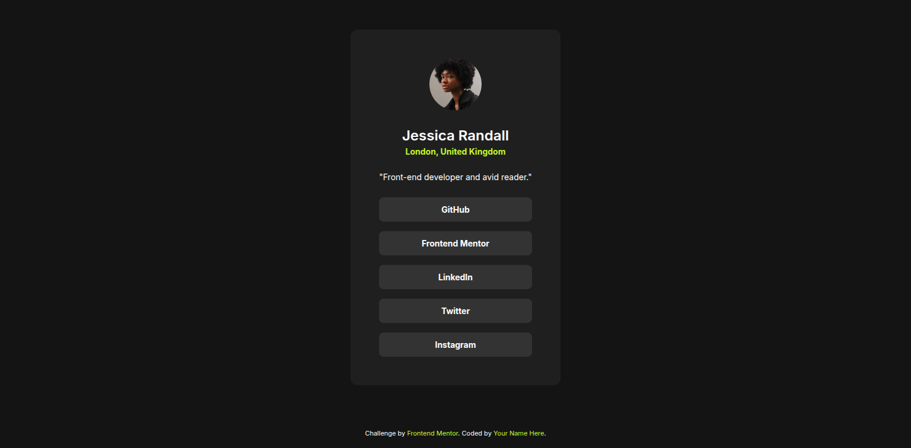

# Frontend Mentor - Social Links Profile Solution

This is a solution to the [Social links profile challenge on Frontend Mentor](https://www.frontendmentor.io/challenges/social-links-profile-UG32l9m6dQ). Frontend Mentor challenges help you improve your coding skills by building realistic projects.

## Table of contents

- [Overview](#overview)
  - [The challenge](#the-challenge)
  - [Screenshot](#screenshot)
  - [Links](#links)
- [My process](#my-process)
  - [Built with](#built-with)
  - [What I learned](#what-i-learned)
  - [Continued development](#continued-development)
- [Author](#author)
- [Acknowledgments](#acknowledgments)

## Overview

### The challenge

Users should be able to:

- See hover and focus states for all interactive elements on the page
- View the layout on different screen sizes (responsive design)

### Screenshot



### Links

- Solution URL: [GitHub Repository](https://github.com/yourusername/social-links-profile)
- Live Site URL: [Live Demo](https://yourusername.github.io/social-links-profile)

## My process

### Built with

- Semantic HTML5 markup
- CSS custom properties
- Flexbox
- Mobile-first workflow
- Google Fonts (Inter)

### What I learned

This project helped me practice:

1. **CSS Grid and Flexbox**: Used Flexbox for centering and layout control
2. **Custom CSS Properties**: Implemented the color scheme using HSL values
3. **Hover States**: Created smooth transitions for interactive elements
4. **Responsive Design**: Ensured the design works on both mobile and desktop
5. **Accessibility**: Used semantic HTML and proper focus states

Key CSS techniques used:

```css
.social-link:hover,
.social-link:focus {
  background-color: hsl(75, 94%, 57%);
  color: hsl(0, 0%, 12%);
  outline: none;
}
```

```css
.profile-card {
  background-color: hsl(0, 0%, 12%);
  border-radius: 12px;
  padding: 40px;
  text-align: center;
  width: 100%;
  max-width: 384px;
}
```

### Continued development

Areas I want to continue focusing on:

- Advanced CSS animations and transitions
- CSS Grid for more complex layouts
- Accessibility best practices
- Performance optimization

## Author

- Frontend Mentor - [@afuhflynn](https://www.frontendmentor.io/profile/afuhflynn)
- GitHub - [@afuhflynn](https://github.com/afuhflynn)

## Acknowledgments

Thanks to Frontend Mentor for providing this challenge and helping developers practice their skills with real-world projects.
